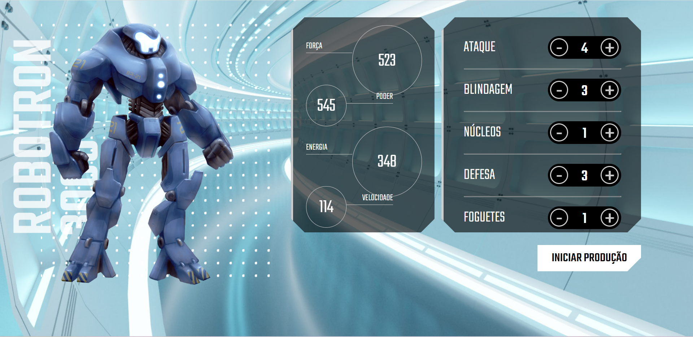

# Robotron 2000

Desenvolvido durante aula de Javascript, realizado na plataforma da Alura, o projeto Robotron 2000 tem como objetivo a manipulação do DOM. 30/11/2022

## 💻 Tecnologias

- Javascript

## Referência

- [Alura] https://www.alura.com.br/escola-front-end

